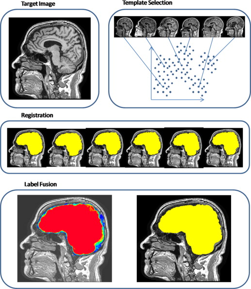

```{r setup, include=FALSE}
library(methods)
knitr::opts_chunk$set(echo = TRUE, comment = "")
```


## Overall Pipeline

 


## Brain Extraction 3 Different Attempts

In this tutorial we will discuss performing brain segmentation using:

- the brain extraction tool (BET) [@smith_fast_2002] in `FSL` [@jenkinson_fsl_2012]
    - without bias correction (method 1) and with (method 2)
- a multi-atlas approach, called "multi-atlas label fusion" with the `malf` command (method 3). 
- (extra slides) a robust version using a wrapper function in `extrantsr`, `fslbet_robust`


## MS Lesion MPRAGE

Let's reset and read in the T1 image from a MS lesion data set:

```{r reading_in_image, message = FALSE}
library(neurobase)
t1_fname = "training01_01_mprage.nii.gz"
t1 = neurobase::readnii(t1_fname)
rt1 = robust_window(t1); 
red0.5 = scales::alpha("red", 0.5) # for plotting later
```

<!-- ## Loading Data from `ms.lesion` -->

<!-- ```{r} -->
<!-- library(ms.lesion) -->
<!-- library(neurobase) -->
<!-- files = get_image_filenames_list_by_subject()$training01 -->
<!-- t1_fname = files["MPRAGE"] -->
<!-- t1 = readnii(t1_fname) -->
<!-- rt1 = robust_window(t1); -->
<!-- red0.5 = scales::alpha("red", 0.5) -->
<!-- ``` -->

## T1-weighted MPRAGE Image

```{r t1_plot_robust}
ortho2(rt1)
```

## Attempt 1: Brain Extraction of T1 image using BET

Here we will use FSL's Brain Extraction Tool (BET) to extract the brain tissue from the rest of the image (general overview):

- 2nd and 98th percentiles are calculated.  (98th - 2nd) * 10% + 2nd percentile used to threshold out background
- From non-thresholded voxels - calculate center of gravity (COG)
- Calculate radius of brain and median intensity of all points within "spherical brain" (used in last step)
- Perform region growing and iterating to get brain surface
- Smooth surface
- Use median intensity to shrink surface to the "real" surface


## Attempt 1: Brain Extraction of T1 image using BET

`fslr` - wraps FSL commands to use in R
    - registration, image manipulation
    
`fslr::fslbet` - takes in a filename/nifti and calls FSL `bet` function
    - additional options can be passed to FSL command in using `opts`

```{r t1_naive_ss, eval = FALSE, cache = FALSE, message = FALSE, warning = FALSE}
library(fslr)
ss = fslbet(infile = t1_fname)
```

```{r t1_naive_ss_run, echo = FALSE, cache = FALSE, message = FALSE, warning = FALSE}
library(fslr)
out_fname = "../output/naive_ss.nii.gz"
if (!file.exists(out_fname)) {
  ss = fslbet(infile = t1_fname)
  writenii(ss, out_fname)
} else {
  ss = readnii(out_fname)
}
```

## FSL BET Results - Missing Brain Tissues (Posterior)

```{r t1_naive_plot_ss}
ortho2(robust_window(ss))
```

## FSL BET Results not Satisfactory

```{r t1_ss_plot}
ortho2(rt1, ss > 0, col.y = red0.5)
```

## Attempt 2: Bias Correct before BET (recommended) 

Before doing skull-stripping/brain extraction, we would do bias correction:

```{r bc_show, eval = FALSE}
library(extrantsr)
bc_img = bias_correct(file = t1, correction = "N4")
```

```{r bc_show_run, echo = FALSE}
bc_fname = "../output/training01_01_mprage_n4.nii.gz"
bc_img = readnii(bc_fname)
bc_img = robust_window(bc_img)
```

```{r bc_bet, eval = FALSE, message = FALSE}
bc_bet = fslbet(bc_img); ortho2(bc_img, bc_bet > 0, col.y = red0.5)
```

```{r bc_bet_run, message = FALSE, echo = FALSE}
out_fname = "../output/bc_bet_ss.nii.gz"
if (!file.exists(out_fname)) {
  bc_bet = fslbet(bc_img); 
  writenii(bc_bet, out_fname)
} else {
  bc_bet = readnii(out_fname)
}
ortho2(bc_img, bc_bet > 0, col.y = red0.5)
```


<!-- ## Attempt 3: Brain Extraction of T1 image using MALF -->

<!-- Figure from Multi-Atlas Skull Stripping method paper [@mass]: -->

<!--  -->


## MALF for Skull Stripping

<div class="container">
<div id="left_col">
Figure from Multi-Atlas Skull Stripping method paper [@mass]:


</div>
<div id="right_col">
- Register templates to an image using the T1 for that subject
- Apply transformation to the label/mask
- Average each voxel over all templates
    - there are "smarter" (e.g. weighted) ways
- `malf.templates` package has templates provided by Neuromorphometrics, Inc. form [MICCAI 2012 Challenge on Multi-atlas Labeling](http://masiweb.vuse.vanderbilt.edu/workshop2012/index.php/Main_Page) [@bennett2012miccai]
    - hand segmentations of the brain and brain structures
</div>
</div>


<!-- ## Attempt 3: Brain Extraction of T1 image using MALF -->

<!-- Multi-Atlas Fusion: -->

<!-- - Register templates to an image using the T1 for that subject -->
<!-- - Apply transformation to the label/mask -->
<!-- - Average each voxel over all templates -->
<!--     - there are "smarter" (e.g. weighted) ways -->
<!-- - `malf.templates` package has templates provided by Neuromorphometrics, Inc. (http://Neuromorphometrics.com/) form MICCAI 2012 Challenge on Multi-atlas Labelling [@bennett2012miccai] -->
<!--     - hand segmentations of the brain and brain structures -->


## MALF - use `extrantsr::malf`

- Function requires arguments: `template.images` (T1-weighted images in this case) and `template.structs` (labels/structures/masks, brain masks here)
- We will use the `extrantsr::malf` function
    - Performs non-linear registration using Symmetric Normalization (`SyN`) [@avants_symmetric_2008], a form of diffeomorphic registration:
    - combines the template structures


```{r t1_malf_ss, echo = TRUE, eval = FALSE}
library(malf.templates) # load the data package
library(extrantsr)
timgs = mass_images(n_templates = 5) # let's register 5 templates
ss = extrantsr::malf(
  infile = bc_img, 
  template.images = timgs$images, 
  template.structs = timgs$masks,
  keep_images = FALSE # don't keep the registered images
)
mask = ss > 0
```

```{r t1_malf_ss_run, echo = FALSE, message = FALSE}
library(malf.templates)
library(extrantsr)
timgs = mass_images(n_templates = 5)
outfile = "../output/training01_01_mprage_mask.nii.gz"
if (!file.exists(outfile)) {
  ss = malf(
    infile = bc_fname, 
    template.images = timgs$images, 
    template.structs = timgs$masks,
    keep_images = FALSE,
    verbose = FALSE,
    outfile = outfile
  )
} else {
  ss = readnii(outfile)
}
mask = ss > 0
```


## MALF performs well


```{r show_them, eval = FALSE}
mask = readnii("training01_01_mprage_mask.nii.gz") # already computed
```

```{r display_malf_result}
ortho2(bc_img, mask, col.y = red0.5)
```


<!-- ## Processed Results Available in `ms.lesion` -->

<!-- In the `ms.lesion` package, we have the brain masks for each subject located in the `coregistered` folder.  You can access this data using the `type = "coregistered"`: -->

<!-- ```{r, echo = TRUE, eval = FALSE} -->
<!-- files = get_image_filenames_list_by_subject( -->
<!--   type = "coregistered")$training01 -->
<!-- files["Brain_Mask"] -->
<!-- brain_mask = readnii(files["Brain_Mask"]) -->
<!-- ``` -->

<!-- ```{r, echo = FALSE} -->
<!-- files = get_image_filenames_list_by_subject( -->
<!--   type = "coregistered")$training01 -->
<!-- files = files["Brain_Mask"] -->
<!-- dd = strsplit(files, "/")$Brain_Mask -->
<!-- ind = which(dd == "library") -->
<!-- dd = dd[seq(ind, length(dd))] -->
<!-- dd = paste(dd, collapse = "/") -->
<!-- print(dd) -->
<!-- ``` -->

<!-- ```{r, echo = FALSE, eval = TRUE} -->
<!-- cofiles = get_image_filenames_list_by_subject( -->
<!--   type = "coregistered")$training01 -->
<!-- brain_mask = readnii(cofiles["Brain_Mask"]) -->
<!-- ``` -->

<!-- ```{r, echo = FALSE, eval = TRUE} -->
<!-- ortho2(t1, brain_mask > 0, col.y = red0.5) -->
<!-- ``` -->


## Conclusions from the MS data

- FSL BET can perform brain extraction (additional ex shows when it works)
    - It did not work sufficiently here
    - There are options you can change for performance
- Bias-correction before brain extraction is a good idea
    - Especially if the method depends on intensities
    - Didn't change the results here
- MALF/MASS is a good option, but needs templates and is computationally expensive
    - weighted templates or local weighting is done in other software (not discussed)
    

## Website

http://johnmuschelli.com/imaging_in_r    
    
# Extra Slides are showing additional BET options

## Additional Example

FSL BET did not work in the previous data set.  It works in many cases, though.  We will look at a subject from the kirby21 dataset [@landman2011multi].


```{r}
library(kirby21.t1)
t1_fname = get_t1_filenames()[1]
t1 = readnii(t1_fname)
```

## T1 image has the neck!

```{r kirby21_t1_plot}
ortho2(robust_window(t1))
```


## Neck messes up BET 

```{r kirby21_t1_naive_ss_run, cache = FALSE, message = FALSE, echo = FALSE}
out_fname = "../output/kirby_naive_ss.nii.gz"
if (!file.exists(out_fname)) {
  ss = fslbet(infile = t1_fname)
  writenii(ss, out_fname)
} else {
  ss = readnii(out_fname)
}
ortho2(robust_window(ss))
```


```{r kirby21_t1_naive_ss_show, eval = FALSE, cache = FALSE, message = FALSE}
ss = fslbet(infile = t1_fname); ortho2(robust_window(ss))
```


## Recommend to Bias Correct first: not fixed


```{r kirby21_bc_bet_show, message = FALSE, eval = FALSE}
bc_img = bias_correct(t1, correction = "N4"); 
bc_bet = fslbet(bc_img)
ortho2(robust_window(t1), bc_bet > 0, col.y = red0.5)
```

```{r kirby21_bc_bet_run, message = FALSE, echo = FALSE}
out_fname = "../output/kirby_bc.nii.gz"
if (!file.exists(out_fname)) {
  bc_img = bias_correct(t1, correction = "N4"); 
  writenii(bc_img, out_fname)
} else {
  bc_img = readnii(out_fname)
}

out_fname = "../output/kirby_bc_bet.nii.gz"
if (!file.exists(out_fname)) {
  bc_bet = fslbet(bc_img)  
  writenii(bc_bet, out_fname)
} else {
  bc_bet = readnii(out_fname)
}
ortho2(robust_window(t1), bc_bet > 0, col.y = red0.5)
```


## BET with neck removal

We use the modification of BET in `extrantsr`, which is called through `fslbet_robust`.  `fslbet_robust`:

- bias correct image
- remove neck (`double_remove_neck` performs 2 registration steps, more robust than one (which is the default).)
- run BET
- estimate center of gravity (COG)
- run BET again with new COG

## `fslbet_robust` syntax

```{r, eval = FALSE}
ss = extrantsr::fslbet_robust(
  t1, 
  remover = "double_remove_neck",
  correct = TRUE,
  correction = "N4",
  recog = TRUE)
```


## BET with neck removal - works well!

```{r t1_ss, cache = FALSE, echo = FALSE}
outfile = nii.stub(t1_fname, bn = TRUE)
outfile = file.path("..", "output", paste0(outfile, "_SS.nii.gz"))
if (!file.exists(outfile)) {
  ss = extrantsr::fslbet_robust(t1_fname,
    remover = "double_remove_neck",
    outfile = outfile)
} else {
  ss = readnii(outfile)
}
```

```{r kirby21_t1_ss_plot_show, cache = TRUE, eval = FALSE}
ortho2(ss)
```

```{r kirby21_t1_ss_plot_run, echo = FALSE, cache = TRUE}
ortho2(dropEmptyImageDimensions(ss))
```

## Conclusions 

- Brain extraction allows you to analyze the brain only
    - Important for tissue segmentation/registration
- BET may work (look at your data!)
    - Should bias correct first 
    - May need to remove neck
    - High values may affect results - may need to remove/Winsorize them


## Website

http://johnmuschelli.com/imaging_in_r


## References {.smaller}

