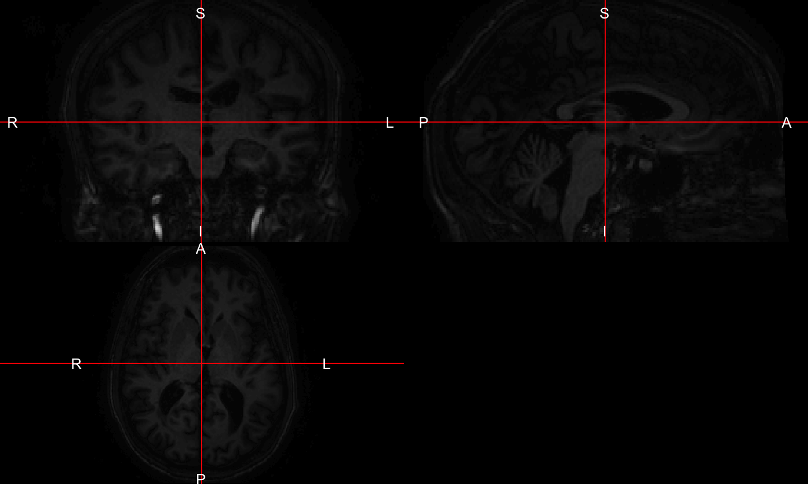

# Brain Extraction/Segmentation with MALF
John Muschelli  
`r Sys.Date()`  


## Overview 
In this tutorial we will discuss performing brain segmentation using the brain extraction tool (BET) in `fsl` and a robust version using a wrapper function in `extrantsr`, `fslbet_robust`. 


## Loading Data


```r
library(ms.lesion)
library(neurobase)
```

```
Loading required package: oro.nifti
```

```
oro.nifti 0.7.2
```

```r
files = get_image_filenames_list_by_subject()$training01
t1_fname = files["MPRAGE"]
t1 = readnii(t1_fname)
```

# T1 image

Again, let's take a look at the T1-weighted image.  


```r
ortho2(robust_window(t1))
```

<!-- -->

# Bias Correction 

Before doing skull-stripping/brain extraction, we would do bias correction:


```r
library(extrantsr)
bc_img = bias_correct(file = t1, correction = "N4")
```


```r
bc_fname = "../output/training01_01_mprage_n4.nii.gz"
bc_img = readnii(bc_fname)
```


# Attempt 1: Brain Extraction of T1 image using BET

Here we will use FSL's Brain Extraction Tool (BET) to extract the brain tissue from the rest of the image.  


```r
library(mass.templates)
library(extrantsr)
timgs = mass_images(n_templates = 5)
ss = malf(infile = bc_img, 
          template.images = timgs$images, 
          template.structs = timgs$masks,
          keep_images = FALSE
          )
```


```r
library(mass.templates)
library(extrantsr)
timgs = mass_images(n_templates = 5)
outfile = "../output/training01_01_mprage_mask.nii.gz"
if (!file.exists(outfile)) {
  ss = malf(infile = bc_fname, 
            template.images = timgs$images, 
            template.structs = timgs$masks,
            keep_images = FALSE,
            verbose = FALSE,
            outfile = outfile
            )
} else {
  ss = readnii(outfile)
}
```


We see that naively, BET does not perform well for this image.

<!-- # Brain Extraction of T1 image using BET -->

<!-- Here we will use FSL's Brain Extraction Tool (BET) to extract the brain tissue from the rest of the image.  We use the modification of BET in `extrantsr`, which is called through `fslbet_robust`.  In `fslbet_robust`, the image is corrected using the N4 inhomogeneity correction.  The neck of the T1 image is then removed and then BET is run, the center of gravity (COG) is estimated, and BET is run with this new COG.  We used a procedure where the neck is removed in 2 registration steps, which is more robust than just the one (which is the default). -->

<!-- ```{r t1_ss, cache = FALSE} -->
<!-- outfile = nii.stub(t1_fname, bn = TRUE) -->
<!-- outfile = paste0(outfile, "_SS.nii.gz") -->
<!-- if (!file.exists(outfile)) { -->
<!--   ss = extrantsr::fslbet_robust(t1_fname,  -->
<!--     remover = "double_remove_neck", -->
<!--     outfile = outfile) -->
<!-- } else { -->
<!--   ss = readnii(outfile) -->
<!-- } -->
<!-- ``` -->

<!-- Let's look at the skull-stripped image. -->
<!-- ```{r t1_ss_plot, cache = TRUE} -->
<!-- ortho2(ss) -->
<!-- ``` -->

<!-- Here we see the skull-stripped image.  But did we drop out "brain areas"? -->

<!-- ```{r t1_ss_plot2, cache = TRUE} -->
<!-- alpha = function(col, alpha = 1) { -->
<!--   cols = t(col2rgb(col, alpha = FALSE)/255) -->
<!--   rgb(cols, alpha = alpha) -->
<!-- }       -->
<!-- ortho2(t1_fname, ss > 0, col.y = alpha("red", 0.5)) -->
<!-- ``` -->

<!-- We can again use `dropEmptyImageDimensions` to remove extraneous slices, which helps with reducing storage of the image on disk, zooming in while plotting, and may aid registration.   -->

<!-- ```{r t1_ss_red, cache = FALSE} -->
<!-- ss_red = dropEmptyImageDimensions(ss) -->
<!-- ortho2(ss_red) -->
<!-- ``` -->

<!-- Again, we can see the zoomed-in view of the image now. -->
