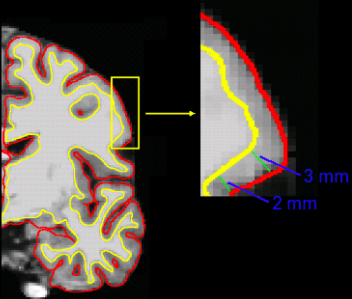
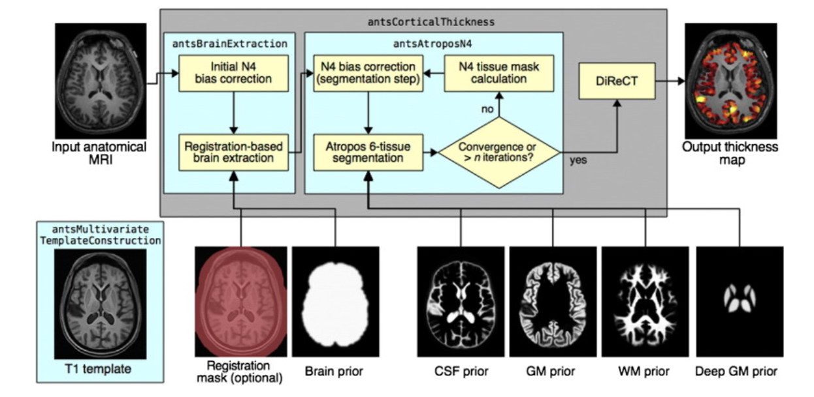
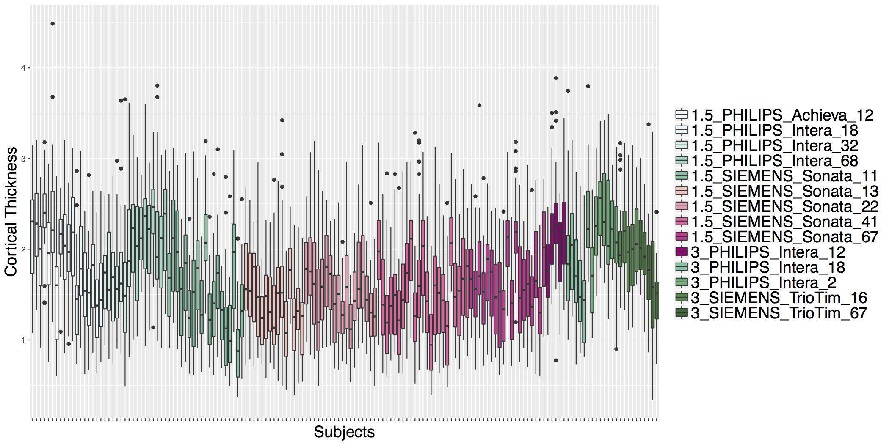
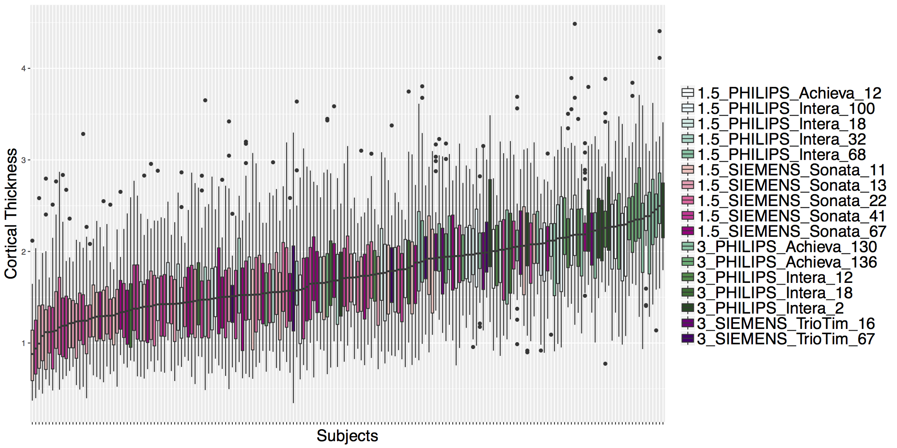
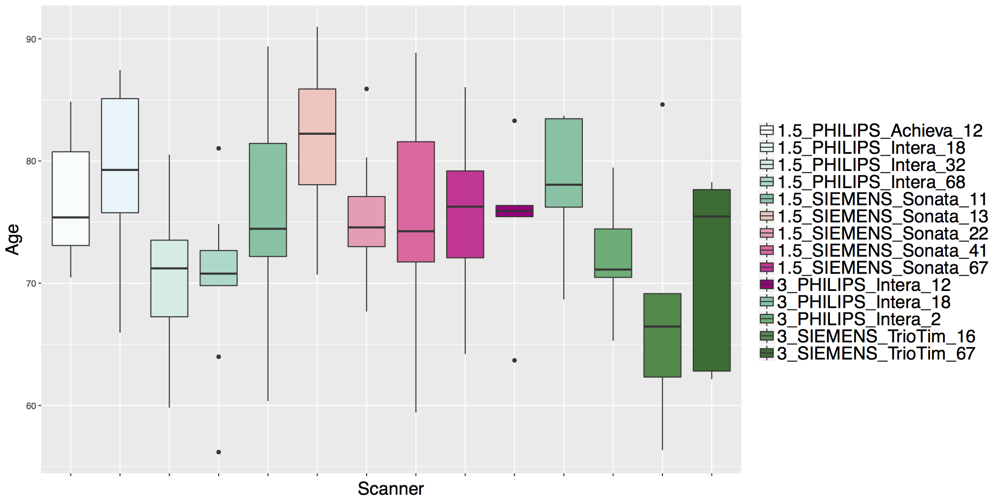
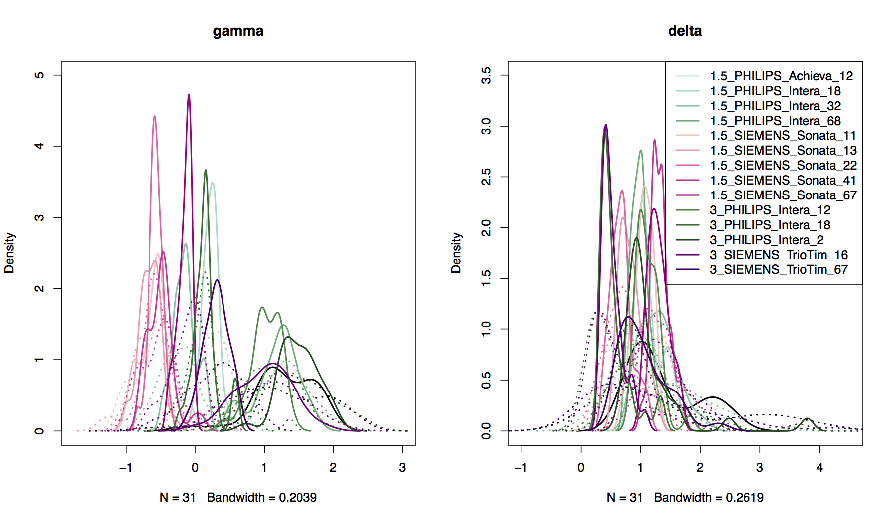
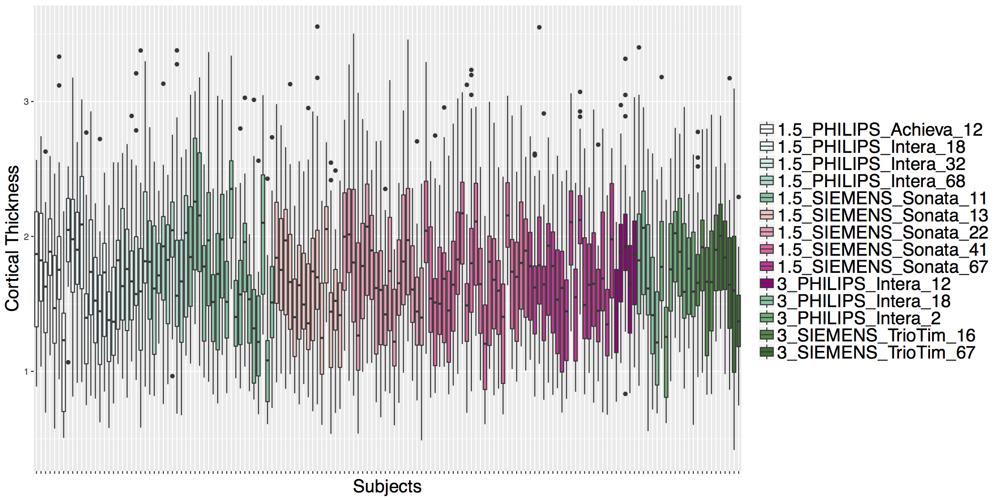
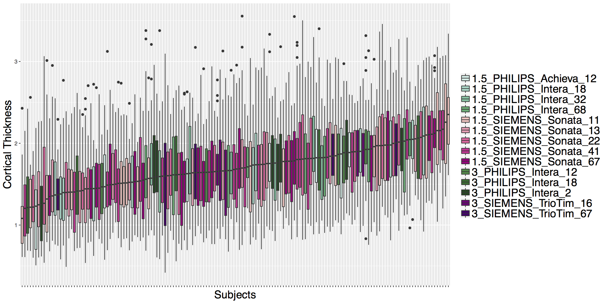
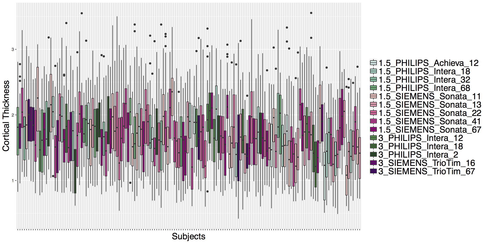

```{r setup, include=FALSE}
knitr::opts_chunk$set(echo = TRUE, comment = "", fig.height = 5.5, fig.width = 5.5, cache = TRUE)
```


## Overall Pipeline

 


## Motivation
- Multi-site imaging studies are becoming increasingly common.
- Combining imaging data across sites introduces non-biological sources of variation that arise from the use of different scanner hardware and acquisition protocols.
    - E.g., field strength, manufacturer, subject positioning
- **Scanner effects** or **site effects** are similar to **batch effects** in the genomics literature   
    - Known to affect measurement of regional volumes, cortical thickness, voxel-based morphometry, ... 
    - More generally, structural, functional, diffusion tensor, and other types of images and  features extracted from them may exhibit scanner effects

## Motivation
- Need to eliminate or account for scanner effects in downstream statistical analyses
    - Most critical if sites or scanners are imbalanced with respect to other variables such as age, sex, race, clinical status
    - Simply including scanner as a confounding variable may not work well (Rao et al. 2017)
- Several methods for estimating and removing unwanted sources of variation due to site/scanner have been adapted to neuroimaging data.
- In this tutorial we will use ComBat [@johnson2007adjusting; @fortin2018harmonization] to harmonize cortical thicknesses from the ADNI data.
  - ComBat has been shown to effectively reduce scanner-to-scanner variability while preserving biological associations.

## ADNI Cortical Thickness Data

- The Alzheimer's Disease Neuroimaging Initiative (ADNI) is a multi-million dollar study funded by public and private sources. 
    - National Institute on Aging, the National Institute of Biomedical Imaging and Bioengineering, the Food and Drug Administration, private pharmaceutical companies, and non-profit organizations. 
- The goals of the ADNI are to better understand progression from normal aging to mild cognitive
impairment (MCI) and early Alzheimer's disease (AD) and determine effective biomarkers for disease diagnosis, monitoring, and treatment development.
- We estimated cortical thicknesses from a subset of initial subject visits (N=156)
    - Mix of male/female and healthy controls, MCI, and AD diagnoses at baseline
- Our subset consists of images aquired from scanners at 14 different sites
    - Mix of field strength, manufacturer, and model

## ADNI Data Access

<a href="http://adni.loni.usc.edu/data-samples/access-data/" target="_blank">http://adni.loni.usc.edu/data-samples/access-data/</a>


## Cortical Thickness
<div class="container">
<div id="left_col">


<div style="font-size: 8pt">
Image taken from [http://www.martinos.org/neurorecovery/technology.htm](http://www.martinos.org/neurorecovery/technology.htm)
</div>
</div>
<div id="right_col">
- There are several different ways to measure cortical thickness
- General idea is to measure perpendicular from the white/gray matter boundary to the pial surface
- Cortical thickness is an important imaging-based biomarker for numerous psychological and neurodegenerative diseases: Alzheimer's and other dementias, Schizophrenia, MS, addiction, ... 
</div>
</div>

## ANTS Cortical Thickness Pipeline (antsCorticalThickness.sh)



- Template: publicly available vs. "cooking" one based on your data
- DiReCT: Diffeomorphic Registration based CT measurement [@das2009registration]

## ANTS Cortical Thickness Pipeline (antsCorticalThickness.sh)


- With tissue priors and N4 corrected T1 from atropos, can use ``cort_thickness`` in ``extrantsr`` package

## Cortical Thickness Regions

- Multi-atlas label fusion applied using 20 OASIS template T1s manually labeled with the Desikan-Killiany-Tourville (DKT) cortical labeling protocol (www.mindboggle.info).

<div class="container">
<div id="left_col">

```{r, echo=FALSE, warning=FALSE, message=FALSE}
library(dplyr)
labels = data.frame('label'=names(read.csv('imageData.csv'))[-1])
rois = read.csv('labels.csv', header=FALSE, stringsAsFactors=FALSE)
colnames(rois) = c('label', 'roi')
regions = left_join(labels, rois, by='label')
regions[1:15,]
```
</div>
<div id="right_col">

</div>
</div>

## ADNI Cortical Thickness Data



## ADNI Cortical Thickness Data



## ADNI Cortical Thickness Data


## ADNI Cortical Thickness Data

- Scanner is often confounded with biological covariates of interest.



## ComBat Model
- ComBat [@johnson2007adjusting; @fortin2018harmonization] assumes the imaging feature measurements can be modeled as a linear combination of the biological variables and the scanner effects with an error term that includes a multiplicative scanner-specific scaling factor:
  $$y_{i,j,v} = \alpha_v + X_{i,j}^{T}\beta_v + Z_{i,j}^{T}\theta_v + \delta_{j,v}\epsilon_{i,j,v}$$ 
    - $y_{i,j,v}$ is average cortical thickness in ROI $v$ from subject $i$, scanner $j$
    - $X_{i,j}^{T}$ is a vector of fixed covariates for subject $i$ scanned on scanner $j$
    - $\alpha_v$, $\beta_v$ are the intercept and slope vector of covariates for measurement $v$
    - $Z_{i,j}^{T}$ is a vector that indicates which scanner subject $i$ was imaged on
    - $\theta_v$ is the vector of additive scanner effects
    - $\delta_{j,v}$ is the multiplicative effect of scanner $j$ on measurement $v$
    - $E(\epsilon_{i,j,v}) = 0$   

## ComBat Harmonization
- Substituting $\gamma_{j,v}$ for $Z_{i,j}^{T}\theta_v$ we have:
  $$y_{i,j,v} = \alpha_v + X_{i,j}^{T}\beta_v + \gamma_{j,v} + \delta_{j,v}\epsilon_{i,j,v}$$ 
- ComBat uses empirical Bayes estimation to improve quality of scanner-specific parameter estimates when sample sizes are small 
    - Let $\gamma_{j,v}^{*}$ and $\delta_{j,v}^{*}$ denote the EB estimates of $\gamma_{j,v}$ and $\delta_{j,v}$, respectively.
- Then, the ComBat-harmonized cortical thicknesses are defined as 
$$y_{i,j,v}^{ComBat} = \frac{y_{i,j,v} - \hat{\alpha}_v - X_{i,j}^{T}\hat{\beta}_v - \gamma_{j,v}^{*}}{\delta_{j,v}^{*}}  + \hat{\alpha}_v + X_{i,j}^{T}\hat{\beta}_v$$

## Applying ComBat

- Need utils.R and combat.R from https://github.com/Jfortin1/ComBatHarmonization

```{r}
source('utils.R')
source('combat.R')
```

- The model matrix should contain covariates of biological interest.

```{r}
modelData = read.csv('modelData.csv')
head(modelData)
```

- We will include age, sex, and diagnosis.

```{r}
mod = model.matrix(~age+factor(sex)+factor(dx), data=modelData)
```

## Applying ComBat

- Let's read in the cortical thickness data.

```{r}
ctData = read.csv('imageData.csv')
head(ctData)[,1:10]
```


## Applying ComBat

- The imaging data needs to be in a separate matrix where rows are features and columns are subjects.
- Let's remove the subject column and transpose the ctData object.

```{r}
img = t(ctData[,-1])
head(img)[,1:10]
```

## Applying ComBat

- Given a model matrix, scanner information, and image data matrix, ComBat just requires a single line of code:

```{r}
harmonized = combat(dat=img, batch=modelData$scanner, mod=mod)
```

- 4 covariates: age, sex (2-level factor), and diagnosis (3-level factor).
- The combat() function returns a list. 

## ComBat Harmonized Data

- The `combat()` function returns a list. 
- Harmonized data are returned as a matrix with the same dimensions as the image data input (rows are features, columns are subjects).

```{r}
head(harmonized$dat.combat)[,1:10]
```

## ComBat Priors

- Compare prior distributions to EB estimated parameter distributions
    - Location: `harmonized$gamma.hat` versus `harmonized$gamma.star`
    - Scale: `harmonized$delta.hat` versus `harmonized$delta.star`



## ADNI Cortical Thickness Data

- Before ComBat


## ADNI Cortical Thickness Data

- After ComBat



## ADNI Cortical Thickness Data

- Before ComBat


## ADNI Cortical Thickness Data

- After ComBat



## ADNI Cortical Thickness Data

- Before ComBat


## ADNI Cortical Thickness Data

- After ComBat



## Example: Test for Site Effects Before ComBat

```{r}
modelData$sex = factor(modelData$sex)
modelData$dx = factor(modelData$dx)
modelData$scanner = factor(modelData$scanner)
```

```{r}
preComBat = left_join(modelData, ctData, by='subject')
preRInsula = lm(X2035 ~ age + sex + dx + scanner, data=preComBat)
summary(aov(preRInsula))
```

## Example: Test for Site Effects After ComBat

```{r}
harmonizedData = as.data.frame(t(harmonized$dat.combat))
harmonizedData$subject = ctData$subject
```

```{r}
postComBat = left_join(modelData, harmonizedData, by='subject')
postRInsula = lm(X2035 ~ age + sex + dx + scanner, data=postComBat)
summary(aov(postRInsula))
```


## Conclusions
- Data harmonization is an important step in any image analysis that combines data from different sites and/or scanners.
- ComBat has been successfully applied to DTI and cortical thickness data to remove scanner effects while preserving biological associations of interest [@fortin2017harmonization; @fortin2018harmonization].
    - ComBat code is located at https://github.com/Jfortin1/ComBatHarmonization
    - Available in R and MATLAB
- To obtain valid statistical inference in downstream analyses, uncertainty in ComBat harmonization should be considered

## Website

<a href="../index.html" target="_blank">http://johnmuschelli.com/imaging_in_r</a>


## References {.smaller}


