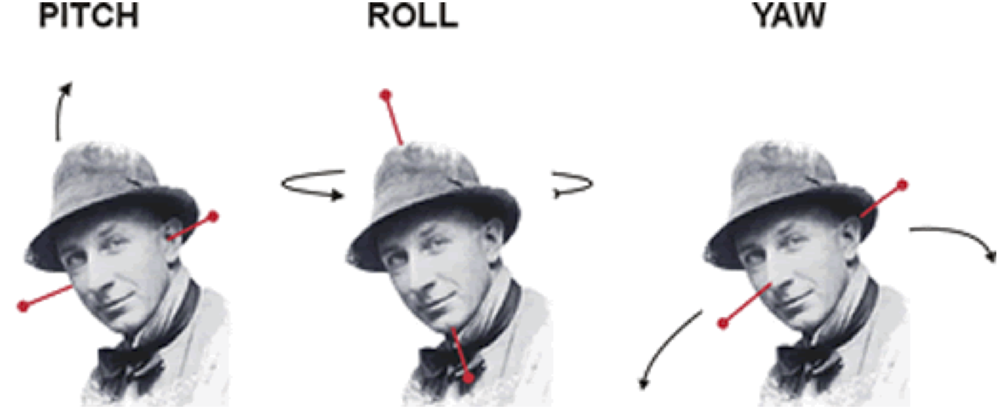
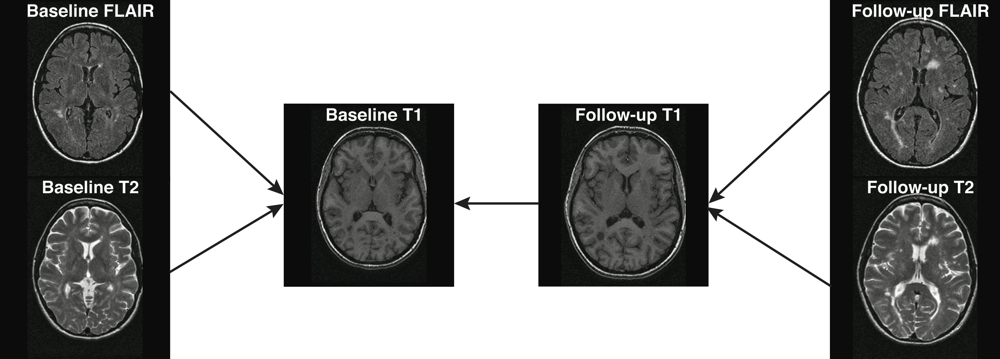
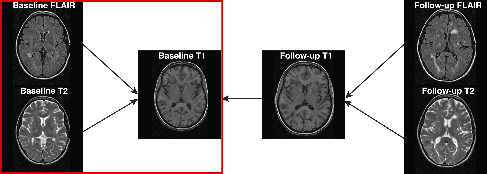

```{r setup, include=FALSE}
library(methods)
knitr::opts_chunk$set(echo = TRUE, comment = "")
options(fsl.path = "/usr/local/fsl/")
options(fsl.outputtype = "NIFTI_GZ")
```


## Overall Pipeline

 


## Lists

- Initialize an empty list and add two elements to it

```{r list}
l = list()
l[[1]] = c(1, 2, 4, 5)
l[[2]] = matrix(1:10, nrow = 2)
print(l)
```

- Subsetting uses double brackets:
```{r listSub}
print(l[[1]])
```

## Subsetting by name

If a `vector` has names, you can also put the 
- Initialize an empty list and add two elements to it

```{r named_vec}
x = c(first = 1, third = 14, second = 5)
print(x)
x[c("third")]
```

If a `list` has names, you can subset with the `$`

- Subsetting uses double brackets:
```{r named_lst}
names(l) = c("V", "m")
l$V
```

## Lists: `lapply`

With `list`s and vectors, there are `apply` functions.  These apply a function to every element of the list.  In this course, we will use:

- `lapply` - apply function and return the elements as a `list`
- `sapply` - apply function and return a "simplified" version
    - if all elements returned are a one-element vector, return a `vector`
    - if element 5 has 3 elements and element 4 has 4 elements, return a `list`
- `mapply` - takes in 2 (or more) lists and "links" the two to perform a function requiring arguments from each list 
    - passing in a list of images and the filenames to write them to


## Overview 
In this tutorial we will discuss performing co-registration of the multiple imaging modalities to the T1-weighted image.  

- `get_image_filenames_list_by_subject` - returns a list, each element is a subject, and each subject has a vector of filenames, named for each modality

```{r t1}
library(ms.lesion)
library(neurobase)
library(extrantsr)
all_files = get_image_filenames_list_by_subject()
names(all_files)
files = all_files$training01
names(files)
t1_fname = files["MPRAGE"]
t1 = readnii(t1_fname)
```

## Types of Registration
- Rigid-body registration (linear) - 6 degrees of freedom (dof)
    - Co-registration (within the same person)
        - Cross-sectional between-sequences
        - Longitudinal within-sequence
        - Longitudinal between-sequences
- Affine registration – 12 dof
- Non-linear (> 12 dof)
    - Usually require a prior affine registration
    - Across-subject registration
    - Registration to a template
        - There are many different templates
    
## Types of Registration
- Rigid-body registration (linear) - 6 degrees of freedom (dof)
    - Co-registration (within the same person)
        - **Cross-sectional between-sequences**
        - **Longitudinal within-sequence**
        - **Longitudinal between-sequences**
- Affine registration – 12 dof
- Non-linear (> 12 dof)
    - Usually require a prior affine registration
    - Across-subject registration
    - Registration to a template
        - There are many different templates

## Rigid Registration: The Math
For a voxel $v$, the rigid transformation can be written as:

$$T_{\rm rigid}(v) = Rv + t$$
where $R =$
\small
$$\left[\begin{array}{ccc} \cos\beta\cos\gamma& \cos\alpha\sin\gamma + \sin\alpha\sin\beta\cos\gamma & \sin\alpha\sin\gamma - \cos\alpha\sin\beta\cos\gamma \\
-\cos\beta\sin\gamma & \cos\alpha\cos\gamma - \sin\alpha\sin\beta\sin\gamma & \sin\alpha\cos\gamma + \cos\alpha\sin\beta\sin\gamma \\
\sin\beta & -\sin\alpha\cos\beta & \cos\alpha\cos\beta \end{array}\right]$$
\normalsize

- 6 degrees of freedom
- $3$ associated with the translation vector: $t=(t_x, t_y, t_z)$
- $3$ associated with the rotation parameters: $\theta=(\alpha, \beta,\gamma)$. 

## 
<div style="font-size: 8pt">
Image taken from [http://cnl.web.arizona.edu/imageprops.htm](http://cnl.web.arizona.edu/imageprops.htm)
</div>

- Pitch - Think of nodding ("yes")
- Yaw - Think of shaking head ("no") (SMH)
- Roll - Think of shoulder shrugging ("I don't know")
- x – left/right
- y – forward/backward
- z – jump up/down 


## Image Registration

The `registration` function from `extrantsr` can register 2 images.  The main arguments are:

- `filename` - either `nifti` object or filename of image to be registered (moving)
- `template.file` - either `nifti` object or filename of target image (fixed)
- `typeofTransform` - transformation of moving to fixed image (Rigid/Affine/SyN)
- `interpolator` - how are voxels averaged in `fixed` space

It can also perform bias correction if `correct = TRUE`.

## Image Registration

For example, if we wanted to register the FLAIR to the T1 image, we would run:

```{r eval = FALSE}
library(extrantsr)
reg = registration(filename = files["FLAIR"], 
                   template.file = files["MPRAGE"],
                   typeofTransform = "Rigid", 
                   interpolator = "linear")
```

The output in `reg` would contain the transformed image and paths to the estimated transformations.  


## A Longitudinal Framework for Registration



## Within-visit co-registration framework



We will register scans within a visit to the T1 of that visit.


## Wrapper function to perform preprocessing
We would like to perform registration within a visit.  The `extrantsr` function `preprocess_mri_within` will do the following steps:

1.  Inhomogeneity correction (N3 or N4)
    - Could also use images from previous lecture
2.  Registration of the files to the first filename (T1)
3.  Skull_stripping using BET if desired
    - We will set this to `FALSE`
    - We will apply our MALF masks later


## Registration within a visit

The function `within_visit_registration` arguments take in:

- `fixed` image - the image to be registered to
- `moving` images - images to register to the `fixed`
- `typeofTransform` - transformation of moving to fixed image (Rigid/Affine)
- `interpolator` - how are voxels averaged in `fixed` space

and outputs a list of transformations (`fwdtransforms`) and output filenames (`outfile`)


## Register to the T1 image

```{r, eval = FALSE}
res = within_visit_registration(
  fixed = files["MPRAGE"],
  moving = files[c("T2", "FLAIR", "PD")],
  correct = TRUE, correction = "N4",
  typeofTransform = "Rigid", 
  interpolator = "Linear"
)
output_imgs = lapply(res, function(x) x$outfile)
names(output_imgs) = c("T2", "FLAIR", "PD")
out = c(MPRAGE = list(t1), output_imgs)
```

```{r registration, eval = TRUE, echo = FALSE}
mods = c("T2", "FLAIR", "PD")
outfiles = file.path("..", "output", basename(files[mods]))
names(outfiles) = mods
if (!all(file.exists(outfiles))) {
  res = within_visit_registration(
    fixed = files["MPRAGE"],
    moving = files[c("T2", "FLAIR", "PD")],
    correct = TRUE, correction = "N4",
    typeofTransform = "Rigid", 
    interpolator = "Linear"
  )
  output_imgs = lapply(res, function(x) x$outfile)
  names(output_imgs) = mods
} else {
  output_imgs = check_nifti(outfiles)
}
xout = c(MPRAGE = list(t1), output_imgs)
mask = xout$MPRAGE > quantile( xout$MPRAGE[ xout$MPRAGE > 0], probs = 0.25)
dd = dropEmptyImageDimensions(mask, 
                               other.imgs = xout)
xout = dd$other.imgs
out = lapply(xout, zscore_img, mask = dd$outimg)
out = lapply(out, window_img, window = c(-4, 4))
```

```{r reg_plot_ortho2_show, eval = FALSE}
double_ortho(out$MPRAGE, out$T2 )
```

```{r reg_plot_ortho2_run, echo = FALSE}
double_ortho(robust_window(xout$MPRAGE), robust_window(xout$T2 ))
```


## Checking Registration

The `multi_overlay` function takes in a list of images and then plots one slice across modalities:

```{r multi_overlay, echo = TRUE}
multi_overlay(out)
```


## Coregistration within a visit results

- Overall, there seems to be good overlap after registration 
- It is usually beneficial to do inhomogeneity correction before registration.
    - just set `correct = TRUE` or pass in the bias-corrected images

**Applying a Brain mask to all registered images**

Now that the images are in the same space as the T1, if we skull-strip the T1 image (we did with MALF), we can apply this mask to those images to extract brain tissues using the `mask_img` command:

```{r bet_t1_show, echo = TRUE, eval = FALSE}
mask = readnii("../output/training01_01_mprage_mask.nii.gz") # MALF mask 
masked_imgs = lapply(out, mask_img, mask)
```

```{r bet_t1, echo = FALSE}
mask = readnii("../output/training01_01_mprage_mask.nii.gz")
sub_mask = applyEmptyImageDimensions(mask, inds = dd$inds)
masked_imgs = lapply(xout, mask_img, sub_mask)
```

## Masked FLAIR Result 

```{r mimgs_2}
orthographic(masked_imgs$FLAIR)
```

## Masked T2 Result 

```{r mimgs_T2}
orthographic(masked_imgs$T2)
```

## Overview of Functions

- Registration within a subject can be done in R
    - `registration` wraps around the reading/writing of images and applying transformations (uses `ANTsR` functions)
    - `double_ortho`, `ortho2`, and `multi_overlay` can provide some basic visual checks to assess registration quality
    - `preprocess_mri_within` and `preprocess_mri_across` are general wrapper functions to process MRI data
- Once images are registered in the same space, operations can be applied to all the images, such as:
    - Masking with a brain mask
    - Transforming images to new spaces with one modality

## Co-registration Overview 

- Co-registration requires a few degrees of freedom (usually 6)
    - sequences from the same individual/brain are more alike than images from different subjects

- Example analyses that do not require a reference template 
    - Identify location-specific longitudinal changes within an individual
    - Tissue class or structural segmentation 
    - Analysis of indvidual-subject change in intensities


## Population Registration

We have only done registration within a subject, but many times you want to perform a population-level analysis.  This requries registration to a **template**:

- The `registration` can be done for this as well, just the `template.file` is now the template image and `filename` is the subject image.
    - other files (in the same space) can be transformed using the `other.files` and `other.outfiles` arguments.  Or:
    - `ants_apply_transforms` can be used to apply this transformations to the other files 

## Website

http://johnmuschelli.com/imaging_in_r
