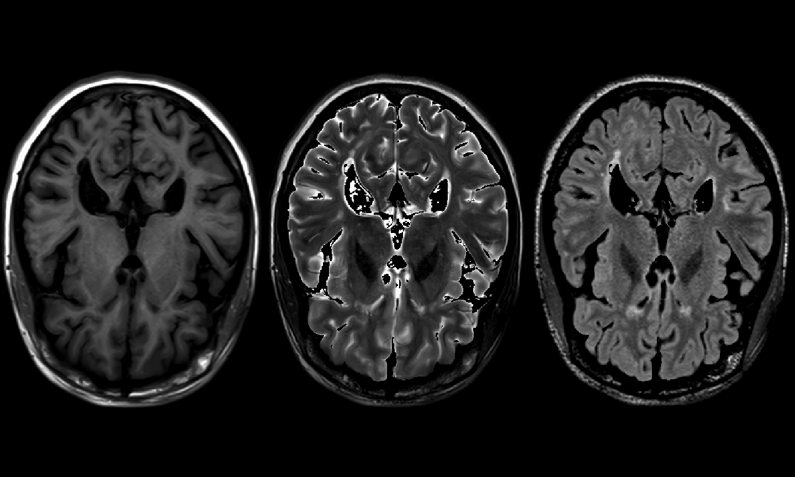
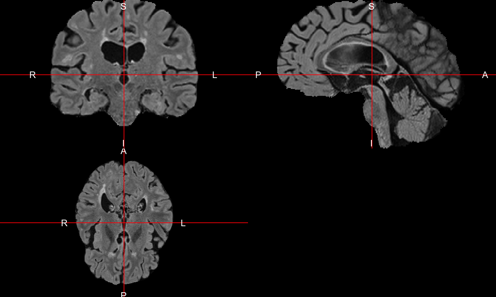

# Co-registration
John Muschelli  
`r Sys.Date()`  


## Overview 
In this tutorial we will discuss performing co-registration of the multiple imaging modalities to the T1-weighted image.


## Loading Data


```r
library(ms.lesion)
library(neurobase)
```

```
Loading required package: oro.nifti
```

```
oro.nifti 0.7.2
```

```r
files = get_image_filenames_list_by_subject()$training01
t1_fname = files["MPRAGE"]
t1 = readnii(t1_fname)
```

# Register to the T1 image


```r
res = within_visit_registration(
  fixed = files["MPRAGE"],
  moving = files[c("T2", "FLAIR", "PD")],
  typeofTransform = "Rigid", 
  interpolator = "Linear"
)
output_imgs = lapply(res, function(x) x$outfile)
names(output_imgs) = c("T2", "FLAIR", "PD")
out = c(MPRAGE = list(t1), output_imgs)
```


## Output of registration


```r
multi_overlay(out)
```

<!-- -->

## Output of Registration


```r
double_ortho(out$MPRAGE, out$T2 )
```

<!-- -->


## Types of Registration
- Rigid-body registration (linear) - 6 degrees of freedom (dof)
    - Co-registration (within the same person)
        - Cross-sectional between-sequences
        - Longitudinal within-sequence
        - Longitudinal between-sequences
- Affine registration – 12 dof
- Non-linear (> 12 dof)
    - Usually require a prior affine registration
    - Across-subject registration
    - Registration to a template
        - There are many different templates
    
## Types of Registration
- Rigid-body registration (linear) - 6 degrees of freedom (dof)
    - Co-registration (within the same person)
        - **Cross-sectional between-sequences**
        - **Longitudinal within-sequence**
        - **Longitudinal between-sequences**
- Affine registration – 12 dof
- Non-linear (> 12 dof)
    - Usually require a prior affine registration
    - Across-subject registration
    - Registration to a template
        - There are many different templates

## Rigid Registration: The Math
For a voxel $v$, the rigid transformation can be written as:

$$T_{\rm rigid}(v) = Rv + t$$
where $R =$
\small
$$\left[\begin{array}{ccc} \cos\beta\cos\gamma& \cos\alpha\sin\gamma + \sin\alpha\sin\beta\cos\gamma & \sin\alpha\sin\gamma - \cos\alpha\sin\beta\cos\gamma \\
-\cos\beta\sin\gamma & \cos\alpha\cos\gamma - \sin\alpha\sin\beta\sin\gamma & \sin\alpha\cos\gamma + \cos\alpha\sin\beta\sin\gamma \\
\sin\beta & -\sin\alpha\cos\beta & \cos\alpha\cos\beta \end{array}\right]$$
\normalsize

- 6 degrees of freedom
- $3$ associated with the translation vector: $t=(t_x, t_y, t_z)$
- $3$ associated with the rotation parameters: $\theta=(\alpha, \beta,\gamma)$. 

## \includegraphics{rollpitchyaw.pdf}
\small Image taken from [http://cnl.web.arizona.edu/imageprops.htm](http://cnl.web.arizona.edu/imageprops.htm)
\normalsize

- Pitch - Think of nodding ("yes")
- Yaw - Think of shaking head ("no") (SMH)
- Roll - Think of shoulder shrugging ("I don't know")
- x – left/right
- y – forward/backward
- z – jump up/down 


## Overall Framework
\includegraphics{Reg_Figure_Option1_short.pdf}

## Within-visit co-registration of sequences
First, we will register scans within a visit to the T1 of that visit:
\includegraphics{Reg_Figure_Option1_short_within.pdf}

## Co-registration/Registration within the same subject
- Requires fewer degrees of freedom
    - sequences from the same individual/brain are more alike than images from different subjects

- Example analyses that do not require a reference template 
    - Identify location-specific longitudinal changes within an individual
    - Tissue class or structural segmentation 
    - Analysis of indvidual-subject change in intensities


## Reading in the T1 scan from visit 1
We will use the data from the Kirby21 dataset.  Here we read in the T1 (denoted by MPRAGE) scan from visit 1:


## FLIRT: FSL's Linear Registration Tool

 - From FSL: ``FLIRT (FMRIB's Linear Image Registration Tool) is a fully automated robust and accurate tool for linear (affine) intra- and inter-modal brain image registration''

- Here we will register the scan with the skull on.


## Coregistration within a visit results

- Overall, there seems to be good overlap after registration with `ANTsR`
- Although we ran the registration on the raw data, it is usually beneficial to do inhomogeneity correction before registration.

## Wrapper function to perform preprocessing
The `extrantsr` function `preprocess_mri_within` will do the following steps:

1.  Inhomogeneity correction
2.  Registration of the files to the first filename


## Applying a Brain mask to all registered images
Now that the images are in the same space as the T1, if we skull-strip the T1 image, we can apply this mask to those images to extract brain tissues.


```r
mask = readnii("../output/training01_01_mprage_mask.nii.gz")
sub_mask = applyEmptyImageDimensions(mask, inds = dd$inds)
masked_imgs = lapply(xout, mask_img, sub_mask)
```

## Result 


```r
orthographic(masked_imgs[[2]])
```

<!-- -->

## Overview

- Registration within a subject can be done in R
    - `ants_regwrite` wraps around the reading/writing of images and applying transformations
    - `double_ortho` and `ortho2` can provide some basic visual checks to assess registration quality
    - `preprocess_mri_within` and `preprocess_mri_across` are general wrapper functions to process MRI data
- Once images are registered in the same space, operations can be applied to all the images, such as:
    - Masking with a brain mask
    - Transforming images to new spaces with one modality


