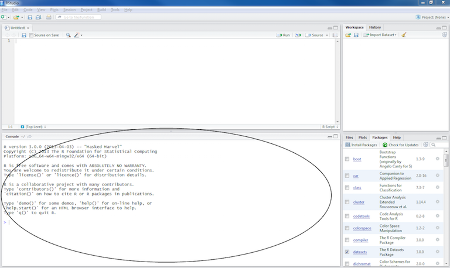
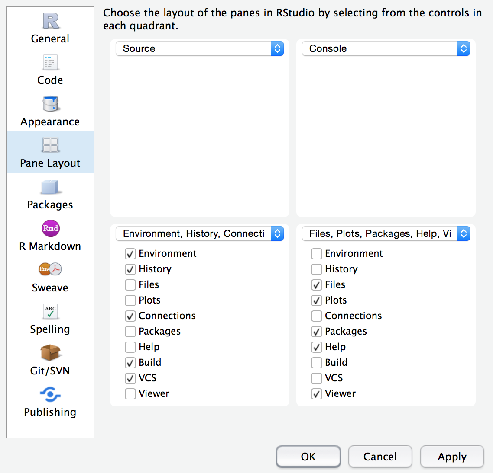
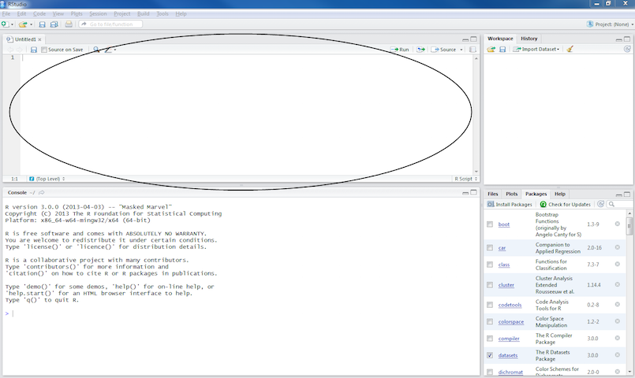
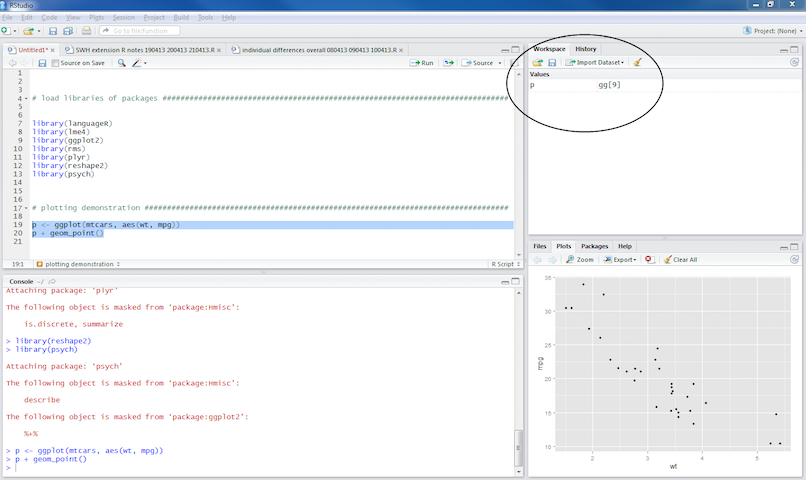

```{r, echo = FALSE}
library(methods)
library(knitr)
opts_chunk$set(comment = "")
```

## About Us

**John Muschelli** 

Assistant Scientist, Department of Biostatistics

PhD in Biostatistics, ScM in Biostatistics

Email: jmusche1@jhu.edu

## About Us

**Kristin Linn**

Assistant Professor, Department of Biostatistics and Epidemiology Perelman School of Medicine, University of Pennsylvania

PhD in Biostatistics

Email: klinn@mail.med.upenn.edu


## Learning Objectives

- Introduction to the Statistical Software R
- Reading and Writing Images
- Visualization of Images and Image Data
- Inhomogeneity Correction 
- Brain Extraction 
- Image Segmentation 
- Coregistration Within and Between MRI Studies
- Intensity Normalization
- Segmentation of MS lesions


## Course Website/Materials

The Course overview is located at (with slides):
http://johnmuschelli.com/ISBI_2017.html

All materials for this course (including source for the slides) is located at:

https://github.com/muschellij2/imaging_in_r


## RStudio Server

For this course, we will use an RStudio Server because installing all the packages can be a lengthy process.  Mostly all the code we show requires a Linux/Mac OSX platform for FSL and other systems:

http://johnmuschelli.com/rstudio_server.html

The code to make the server is located at:
https://github.com/muschellij2/rneuro/blob/master/ms_rstudio_droplet.sh

## Installing R: Local

If you want to install 

* You can install the latest R from [http://cran.r-project.org/](http://cran.r-project.org/)

* [Install RStudio](https://www.rstudio.com/products/rstudio/download/)


# Introduction to R

## What is R?

- R is a language and environment for statistical computing and graphics

- R is the open source implementation of the S language, which was developed by Bell laboratories

- R is both open source and open development

(source: http://www.r-project.org/)


## Why R?

* Powerful and flexible

* Free (open source)

* Extensive add-on software (packages)

* Designed for statistical computing

* High level language

## Why not R?

* Fairly steep learning curve

    * "Programming" oriented
    
    * Minimal interface
    
* Little centralized support, relies on online community and package developers

* Annoying to update

* Slower, and more memory intensive, than the more traditional programming languages (C, Java, Perl, Python)


## Working with R
* The R Console "interprets" whatever you type
    * Calculator
    * Creating variables
    * Applying functions

* "Analysis" Script + Interactive Exploration
    * Static copy of what you did (reproducability)
    * Try things out interactively, then add to your script

# R essentially is a command line with a set of functions loaded

## R Uses Functions, in Packages

* R revolves around functions
    * Commands that take input, performs computations, and returns results
    * When you download R, it has a "base" set of functions/packages (**base R**)
* Functions are enclosed in packages
    * These written by R users/developers (like us) - **some are bad**
    * Think of them as "R Extensions"
    
## RStudio (the software)

RStudio is an Integrated Development Environment (IDE) for R

  * It helps the user effectively use R.
  * Makes things easier  
* Is NOT dropdown statistical tools (such as Stata)
    * See [Rcmdr](https://cran.r-project.org/web/packages/Rcmdr/index.html) or [Radiant](http://vnijs.github.io/radiant/) 

* All snapshots in these slides are taken from http://ayeimanol-r.net/2013/04/21/289/

## RStudio

Easier working with R 

* Syntax highlighting, code completion, and smart indentation
* Easily manage multiple working directories and projects

More information

* Workspace browser and data viewer
* Plot history, zooming, and flexible image and PDF export
* Integrated R help and documentation
* Searchable command history

## RStudio/R Console 

## RStudio/R Console

* Where code is executed (where things happen)
* You can type here for things interactively
* Code is **not saved** on your disk

## RStudio Layout

If RStudio doesn't look like this (or our RStudio), then do:

RStudio --> Preferences --> Pane Layout

```{r, out.width = "500px", echo = FALSE}

```


## Source/Editor 

## Source

* Where files open to
* Have R code and comments in them
* Can highlight and press (CMD+Enter (Mac) or Ctrl+Enter (Windows)) to run the code

In a .R file (we call a script), code is saved on your disk

## Workspace/Environment 

## Workspace/Environment

* Tells you what **objects** are in R
* What exists in memory/what is loaded?/what did I read in?

History

* Shows previous commands.  Good to look at for debugging, but **don't rely** on it as a script.  Make a script!
* Also type the "up" key in the Console to scroll through previous commands

## Other Panes

* **Files** - shows the files on your computer of the directory you are working in
* **Viewer** - can view data or R objects
* **Help** - shows help of R commands
* **Plots** - pretty pictures
* **Packages** - list of R packages that are loaded in memory
