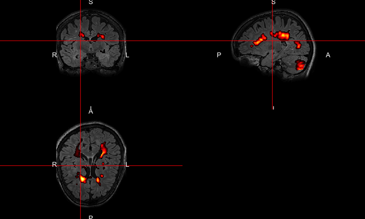
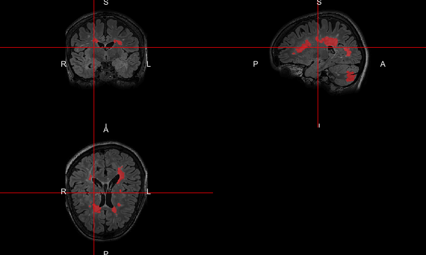
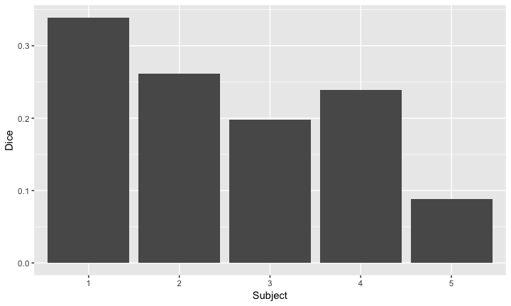
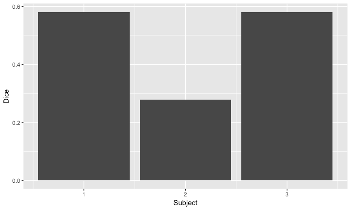
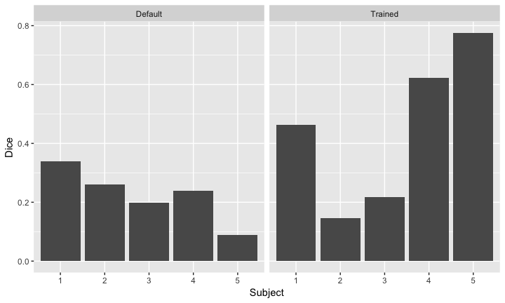

# MS Lesion Segmentation


## Overall Pipeline

 


## Background

- Obtaining manual lesion segmentations is often resource intensive.
- "Gold standard": Inter- and Intra-rater variability
- Accurate and efficient methods for automatic segmentation are necessary for scalability and research progress.
- In this tutorial, we will learn how to train and apply OASIS [@sweeney2013oasis], an automatic lesion segmentation model, to obtain predicted lesion probability maps.
    - relies on intensity-normalized data


## MS Lesion Segmentation with OASIS
- **O**ASIS is **A**utomated **S**tatistical **I**nference for **S**egmentation [@sweeney2013oasis].
- OASIS takes FLAIR, T1, T2, and PD (optional) images. 
    - Produces OASIS probability maps of MS lesion presence.
    - These can be thresholded into a binary lesion segmentation.
- The OASIS model is based on a logistic regression. 
  - Regress binary manual segmentation labels on the images, smoothed versions of the images, and some interaction terms (e.g., supervised learning).
  - Performed well compared to common machine learning models [@sweeney2014comparison]

## Default OASIS Model
- The OASIS library comes with default parameters that can be used to generate probability maps for new test subjects.
  - The default model was trained on approximately 100 MS subjects and 30 healthy subjects with manual segmentations.
- Here we apply `oasis_predict` with the default model to obtain OASIS probability maps for the test subjects.


```r
library(oasis)
default_predict_ts = function(x){
  res = oasis_predict(
      flair=ts_flairs[[x]], t1=ts_t1s[[x]], 
      t2=ts_t2s[[x]], pd=ts_pds[[x]], 
      brain_mask = ts_masks[[x]], 
      preproc=FALSE, normalize=TRUE, 
      model=oasis::oasis_model)
  return(res)
}
default_probs_ts = lapply(1:3, default_predict_ts)
```

## Vizualization of probability map
- Here's the probability map for test subject 01.

<!-- -->

## Thresholding: Getting a binary map 

- We must choose a cutoff to binarize the OASIS probability maps.
- The `binary` argument in the `oasis_predict` function is FALSE by default, resulting in the output being the probability map.
    - Setting `binary=TRUE` will return the thresholded version, using the input to the `threshold` argument (default = 0.16).
    - 0.16 was obtained via a validation set allowing for a 0.5% false positive rate.
- In practice, we might want to use a grid search over thresholds and cross validation to choose the cutoff.

## Vizualization of binary map
- Here's the binary mask for test subject 01, using the default 0.16 threshold:

<!-- -->

## Default OASIS Model
- To evaluate how the default model with default threshold performs, we'll compare the predictions to our manual segmentations.


- Sorensen–Dice coefficient
  - Similarity measure between two samples 
  - Ranges from 0 to 1
  - (TP) - true positive, (FP) - false positive, (FN) - false negative

$$D = \frac{2TP}{2TP + FP + FN}$$


## Default OASIS Model Results
Dice coeffients for the test subjects  

<!-- -->

## Improving Results
- We might be able to improve the results by adjusting the threshold.
- Let's optimize the threshold on the training data using a grid search (in practice, we might do cross-validation)


```
                                                
Threshold    0.050 0.100 0.150 0.200 0.250 0.300
Average Dice 0.242 0.272 0.273 0.261 0.231 0.194
```

## Improving Results
- Turns out a coarse grid search chose a threshold of 0.15, so results are nearly identical.


<!-- -->

## Improving Results
- We might be able to further improve the results by re-training the OASIS model using our five training subjects.
- To re-train using new data, binary masks of gold standard lesion segmentations are needed and should be in T1 space.


## Making OASIS data frames
- OASIS requires a particular data frame format, which we create using the function `oasis_train_dataframe`.
- Includes an option to preprocess your data (`preproc`), which does (1) inhomogeneity correction using `fsl_biascorrect`
and (2) rigid coregistration using `flirt` to the T1 space.
- Includes an option to whole-brain intensity normalize (`normalize`).
- `make_df()` below is a helper function.


```r
make_df = function(x){
  res = oasis_train_dataframe(
      flair=tr_flairs[[x]], t1=tr_t1s[[x]], t2=tr_t2s[[x]],
      pd=tr_pds[[x]], gold_standard=tr_golds[[x]], 
      brain_mask=tr_masks[[x]], 
      preproc=FALSE, normalize=TRUE, return_preproc=FALSE)
  return(res$oasis_dataframe)
}
oasis_dfs = lapply(1:5, make_df)
```

## Training OASIS 
- The function `oasis_training` takes the data frames we made and fits a logistic regression using labels and features from a subset of voxels in each subject's brain mask (top 15\% in FLAIR intensity).
- The function `do.call` is a useful R function that applies the function named in the first argument to all elements of the list specified in the second argument. 


```r
ms_model = do.call("oasis_training", oasis_dfs)
```

## OASIS model object


```r
print(ms.lesion::ms_model)
```

```

Call:  glm(formula = form, family = binomial, data = df)

Coefficients:
   (Intercept)        FLAIR_10           FLAIR        FLAIR_20  
      -4.79369        13.10386         1.14120       -18.77010  
         T2_10              T2           T2_20           T1_10  
       4.85370         1.09444        -7.06750        13.63554  
            T1           T1_20  FLAIR_10:FLAIR  FLAIR:FLAIR_20  
       1.04771       -21.09848        -1.28891         1.03121  
      T2_10:T2        T2:T2_20        T1_10:T1        T1:T1_20  
       0.09151         3.18903        -1.04701         3.14265  

Degrees of Freedom: 3930444 Total (i.e. Null);  3930429 Residual
Null Deviance:	    2691000 
Residual Deviance: 1842000 	AIC: 1842000
```

## Trained OASIS Model Results

```
                                               
Threshold    0.050 0.100 0.150 0.200 0.25 0.300
Average Dice 0.253 0.324 0.346 0.346 0.33 0.294
```
- Using a threshold of 0.5.
- Dice coeffients for default vs. re-trained OASIS model

<!-- -->


## Improvement

- Percent improvement in Dice over the default model:


ID   Dice  
---  ------
01   -31.7 
02   -85.7 
03   -47.7 


## Website

[http://johnmuschelli.com/imaging_in_r](../index.html)

## References {.smaller}


